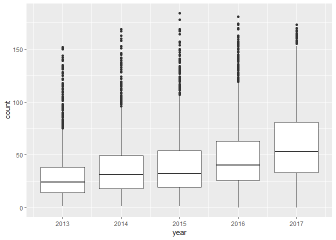
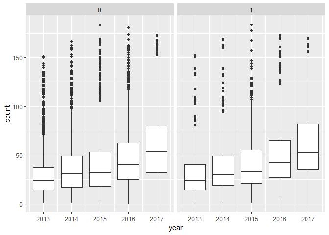
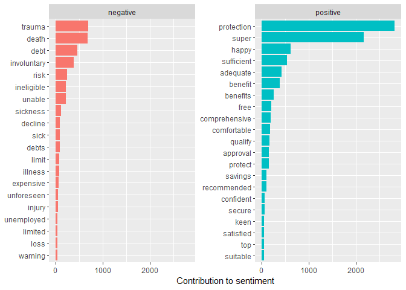

Text Mining
================

``` r
library(tm)
library(tidytext)
library(dplyr)
library(tidyr)
library(tidyverse)
```

``` r
text<-read_csv("C:/Users/Michael/Desktop/text_v2.csv")
text_df<-data_frame(text=text$diary)
```

``` r
nwords <- function(string, pseudo=F){
  ifelse( pseudo,
         pattern <- "\\S+",
         pattern <- "[[:alpha:]]+"
  )
  
  str_count(string, pattern)
 }

text$diary<-as.character(text$diary)

text$count<-nwords(text$diary)
```

``` r
ggplot(text, aes(x = year, y = count, group=year), alpha=0.55) +
  geom_boxplot()
```

    ## Warning: Removed 4 rows containing non-finite values (stat_boxplot).



``` r
ggplot(text, aes(x = year, y = count, group=year), alpha=0.55) +
  geom_boxplot() +
  facet_grid(.~purchased)
```

    ## Warning: Removed 4 rows containing non-finite values (stat_boxplot).



``` r
text_df<-data_frame(text=text$diary)

text_df<-text_df%>%drop_na()

data(stop_words)

ttext<-text_df%>%
  ungroup()%>%
  unnest_tokens(word,text)

ttext_count<-text_df %>%
  unnest_tokens(word, text)%>%
  anti_join(stop_words)%>%
  inner_join(get_sentiments("bing")) %>%
  count(word, sentiment,sort = TRUE)%>%
  ungroup()


ttext_count%>%
  group_by(sentiment) %>%
  top_n(20) %>%
  ungroup() %>%
  mutate(word = reorder(word, n)) %>%
  ggplot(aes(word, n, fill = sentiment)) +
  geom_col(show.legend = FALSE) +
  facet_wrap(~sentiment, scales = "free_y") +
  labs(y = "Contribution to sentiment",x = NULL) +
  coord_flip()
```



``` r
ttext_bigrams<-text_df%>%
  unnest_tokens(bigram, text, token = "ngrams", n = 2) %>%
  separate(bigram, c("word1", "word2"), sep = " ") %>%
  filter(!word1 %in% stop_words$word,
         !word2 %in% stop_words$word) %>%
  count(word1, word2, sort = TRUE)

ttext_bigrams
```

    ## # A tibble: 37,983 x 3
    ##    word1      word2          n
    ##    <chr>      <chr>      <int>
    ##  1 financial  planner     2949
    ##  2 financial  planning    1763
    ##  3 planning   options     1162
    ##  4 income     protection  1079
    ##  5 loan       protection   780
    ##  6 life       disability   668
    ##  7 protection insurance    619
    ##  8 life       cover        600
    ##  9 insurance  planning     596
    ## 10 contents   insurance    515
    ## # ... with 37,973 more rows

``` r
bigrams_united <- ttext_bigrams %>%
    unite(bigrams,word1, word2, sep = " ")%>%
    arrange(desc(n))

bigrams_united
```

    ## # A tibble: 37,983 x 2
    ##    bigrams                  n
    ##    <chr>                <int>
    ##  1 financial planner     2949
    ##  2 financial planning    1763
    ##  3 planning options      1162
    ##  4 income protection     1079
    ##  5 loan protection        780
    ##  6 life disability        668
    ##  7 protection insurance   619
    ##  8 life cover             600
    ##  9 insurance planning     596
    ## 10 contents insurance     515
    ## # ... with 37,973 more rows

``` r
ttext_trigram<-text_df%>%
    unnest_tokens(trigram, text, token = "ngrams", n = 3) %>%
    separate(trigram, c("word1", "word2", "word3"), sep = " ") %>%
    filter(!word1 %in% stop_words$word,
           !word2 %in% stop_words$word,
           !word3 %in% stop_words$word) %>%
    count(word1, word2, word3, sort = TRUE)

ttext_trigram
```

    ## # A tibble: 34,453 x 4
    ##    word1           word2           word3               n
    ##    <chr>           <chr>           <chr>           <int>
    ##  1 loan            protection      insurance         453
    ##  2 insurance       planning        options           440
    ##  3 life            disability      unemployment      266
    ##  4 financial       planning        acknowledgement   213
    ##  5 lpi             financial       planning          207
    ##  6 planning        acknowledgement form              198
    ##  7 acknowledgement form            received          197
    ##  8 financial       planning        referral          172
    ##  9 planning        options         form              163
    ## 10 bbl             financial       planner           138
    ## # ... with 34,443 more rows

``` r
trigrams_united <- ttext_trigram %>%
    unite(trigrams,word1, word2, word3,sep = " ")%>%
    arrange(desc(n))

trigrams_united
```

    ## # A tibble: 34,453 x 2
    ##    trigrams                               n
    ##    <chr>                              <int>
    ##  1 loan protection insurance            453
    ##  2 insurance planning options           440
    ##  3 life disability unemployment         266
    ##  4 financial planning acknowledgement   213
    ##  5 lpi financial planning               207
    ##  6 planning acknowledgement form        198
    ##  7 acknowledgement form received        197
    ##  8 financial planning referral          172
    ##  9 planning options form                163
    ## 10 bbl financial planner                138
    ## # ... with 34,443 more rows
